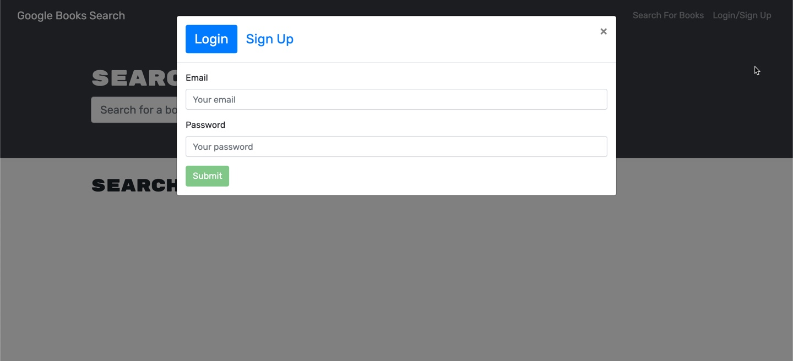

# Book Search Engine

## Description
This system allows users to search for any book agains Googles publicly available API and save to their user for reference the next time they login. The appliation was created using a MERN stack and connected by ApolloServer and ApolloProvider node packages. After launching the application, users can signup or login. Features on the site become accessible or hidden depending on if the user is logged in or not. This is tracked using JSON web tokens. The power behind the application is thanks to the implementation of GraphQL which allows for very dynamic user queries and mutations.

<a href="https://github.com/heather-everton/Book-Search-Engine"><strong>Explore the docs »</strong></a>
 
<a href="https://bookapedia.herokuapp.com/"><strong>Access the hosted application here</strong></a>
 

## Table of Contents
* [Tools](#tools)
* [Preview](#preview)
* [Questions](#questions)
* [Contributing](#contributing)

## Tools
* [NodeJS](https://nodejs.org/en)
* [Express](https://expressjs.com/)
* [MongoDB](https://www.mongodb.com/cloud/atlas)
* [Mongoose](https://mongoosejs.com/)
* [Apollo](https://www.apollographql.com/)
* [React](https://reactjs.org/)
* [GraphQL](https://graphql.org/)
* [Google Book API](https://developers.google.com/books)

### Preview

## Questions
If you have any questions about the repo, open an issue or contact me directly at heathereverton88@gmail.com. You can find more of my work at (https://github.com/heather-everton/).

## Contributing
If you're interested in contributing please reach out to me via email. 

## Roadmap

See the [open issues](https://github.com/heather-everton/Book-Search-Engine/issues) for a list of proposed features (and known issues).
